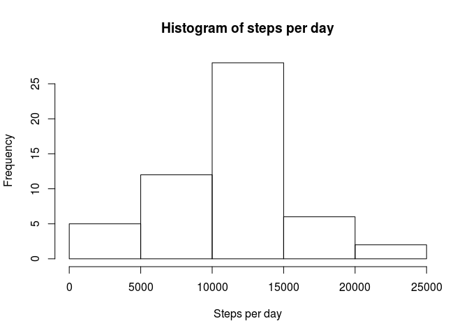
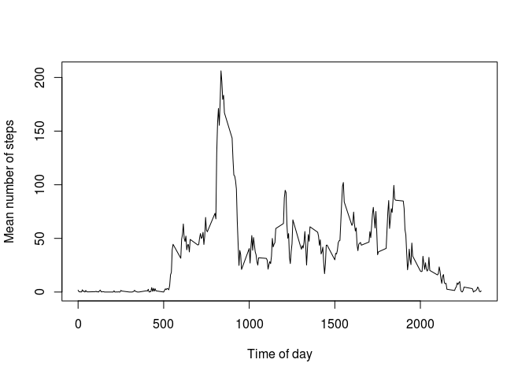
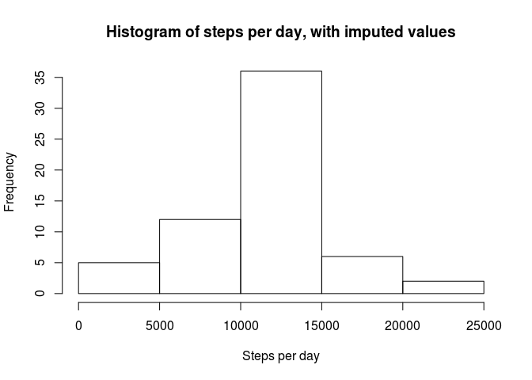
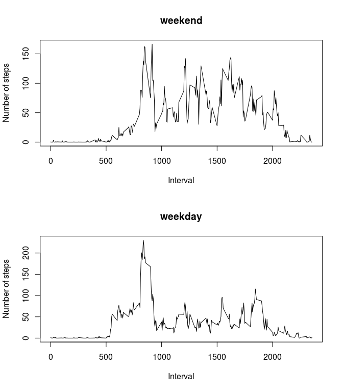

# Reproducible Research: Peer Assessment 1


## Loading and preprocessing the data

```r
setwd('~/src/RepData_PeerAssessment1')
rawData = read.csv(file='activity.csv')
# remove NA
d = rawData[complete.cases(rawData), ]
```


## What is mean total number of steps taken per day?

```r
stepsByDay = aggregate(d$steps, by=list(d$date), FUN=sum)
hist(stepsByDay$x, xlab='Steps per day', main='Histogram of steps per day')
```

\

```r
meanStepsPerDay = mean(stepsByDay$x)
medianStepsPerDay = median(stepsByDay$x)
```
- The mean total number of steps per day is 10766.19.
- The median number of steps per day is 10765.


## What is the average daily activity pattern?

```r
stepsByTimeOfDay = aggregate(d$steps, by=list(d$interval), FUN=mean)
plot(x = stepsByTimeOfDay$Group.1, y = stepsByTimeOfDay$x, type = "l", 
     xlab = "Time of day", ylab = "Mean number of steps")
```

\

```r
maxInterval = stepsByTimeOfDay[which.max(stepsByTimeOfDay$x),1]
```
- The maximum number of steps is contained in interval 0835 - 0840

## Imputing missing values


```r
numMissingValues = sum(is.na(rawData$steps))
```
- Number of missing values = 2304

- Strategy for filling in NA data: take from mean steps by time of day:

```r
dWithImputed = rawData
dWithImputed[is.na(dWithImputed$steps),1] = stepsByTimeOfDay$x[match(dWithImputed[is.na(dWithImputed$steps),3], stepsByTimeOfDay$Group.1)]
stepsByDayWithImputed = aggregate(dWithImputed$steps, by=list(dWithImputed$date), FUN=sum)
hist(stepsByDayWithImputed$x, xlab='Steps per day', main='Histogram of steps per day, with imputed values')
```

\

```r
meanStepsPerDayWithImputed = mean(stepsByDayWithImputed$x)
medianStepsPerDayWithImputed = median(stepsByDayWithImputed$x)
```
- The mean total number of steps per day is 10766.19.
- The median number of steps per day is 10766.19.

Obviously, as the imputed values were taken from the mean, the mean value has not changed. The median value has become equal to the mean.


## Are there differences in activity patterns between weekdays and weekends?

```r
weekDayEndFactor = factor(ifelse(weekdays(as.Date(dWithImputed$date)) %in% c("Saturday", "Sunday"), "weekend", "weekdays"))
stepsByTimeOfDayWithImputed = aggregate(dWithImputed$steps, by=list(dWithImputed$interval, weekDayEndFactor), FUN=mean)

layout(matrix(c(1,2)), heights = c(2,2))
with (stepsByTimeOfDayWithImputed[stepsByTimeOfDayWithImputed$Group.2 == "weekend", ],
  plot(x = Group.1, y = x, type = "l", xlab = "Interval", ylab = "Number of steps", main="weekend")
)

with (stepsByTimeOfDayWithImputed[stepsByTimeOfDayWithImputed$Group.2 == "weekdays", ],
  plot(x = Group.1, y = x, type = "l", xlab = "Interval", ylab = "Number of steps", main="weekday")
)
```

\

The weekend number of steps are lower, more spread throughout the day and the morning peak is a bit later.
